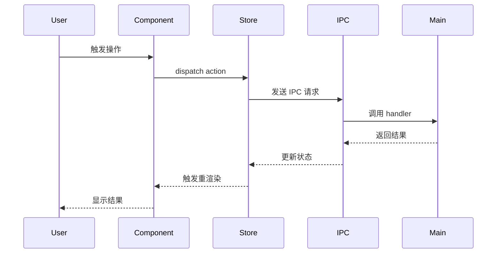
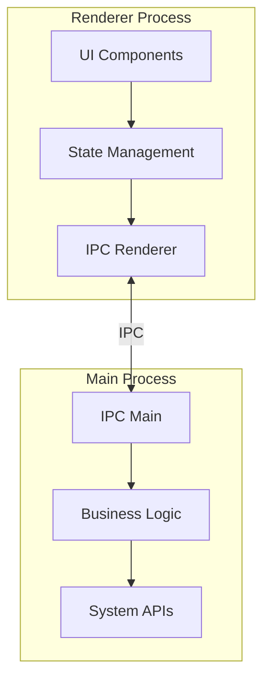

# 任务：Electron 功能域完整调研与架构分析

## 目标
我需要你深度分析 Electron 项目中的 **[功能域名称]** 功能域。请采用系统化、分层递进的方式进行调研，输出一份完整的技术文档，帮助开发者全面理解该功能域的实现细节。

## 分析方法论

请按照以下思维链进行分析，每个步骤都要确保完整性：

### 第一阶段：功能域边界识别
1. **扫描项目结构**，识别与 [功能域名称] 相关的所有文件和目录
2. **绘制功能域地图**，标注主要组件的位置
3. **识别入口点**：用户如何触发该功能？从哪个 UI 组件开始？
4. **追踪数据流**：从用户交互到最终结果的完整路径

### 第二阶段：前端架构深度剖析
对于每个相关的前端组件，请分析：
1. **组件结构**
   - 组件的职责和作用
   - Props/State 定义
   - 生命周期钩子使用情况
   - 子组件关系和组件树

2. **状态管理**
   - 使用的状态管理方案（Redux/MobX/Zustand/Context 等）
   - 该功能域涉及的所有状态切片
   - Actions/Reducers/Selectors 的定义
   - 状态更新流程和副作用处理

3. **UI 交互模式**
   - 用户交互事件处理
   - 表单验证逻辑
   - 加载状态和错误处理
   - 动画和过渡效果

4. **类型定义**
   - TypeScript 接口和类型
   - Props 类型定义
   - 自定义 Hooks 的类型签名

### 第三阶段：后端（Main Process）架构剖析
1. **IPC 通信层**
   - 定义的所有 IPC 通道（channels）
   - ipcMain 监听器的实现
   - 请求/响应的数据结构
   - 错误处理机制

2. **业务逻辑层**
   - 核心业务逻辑的实现
   - 涉及的 Node.js 模块
   - 文件系统/数据库操作
   - 外部 API 调用

3. **系统集成**
   - 操作系统 API 调用
   - 原生模块的使用
   - 进程管理和资源控制

4. **类型系统**
   - Main process 的类型定义
   - IPC 消息的类型约束
   - 共享类型定义

### 第四阶段：前后端联动机制
1. **通信协议设计**
   - IPC 通道命名规范
   - 消息格式和协议
   - 同步 vs 异步通信

2. **数据流转换**
   - 前端数据如何序列化
   - 后端数据如何返回
   - 类型安全保证

3. **错误传播**
   - 后端错误如何传递到前端
   - 前端如何处理错误状态
   - 用户反馈机制

### 第五阶段：架构模式和设计范式
1. **设计模式识别**
   - 使用的设计模式（观察者、工厂、单例等）
   - 架构分层（分离关注点）
   - 依赖注入和控制反转

2. **代码组织**
   - 模块划分原则
   - 文件命名规范
   - 代码复用策略

### 第六阶段：时序分析
创建详细的时序图，展示：
1. 用户触发操作的完整时间线
2. 前端组件的渲染顺序
3. IPC 通信的往返过程
4. 异步操作的并发处理
5. 状态更新的时序

## 输出格式要求

请按照以下 Markdown 结构输出分析结果：

### 文档结构
```
# [功能域名称] 完整技术分析

## 1. 功能概述
- 功能描述
- 用户使用场景
- 核心价值

## 2. 项目结构
```
[使用标准的 tree 格式展示相关文件结构，不要用 JSON]
功能域根目录/
├── frontend/
│   ├── components/
│   │   ├── ComponentA.tsx
│   │   └── ComponentB.tsx
│   ├── store/
│   │   └── featureSlice.ts
│   └── types/
│       └── index.ts
└── main/
    ├── handlers/
    │   └── featureHandlers.ts
    └── services/
        └── featureService.ts
```

## 3. 前端架构

### 3.1 组件体系
[详细描述每个组件]

### 3.2 状态管理
[状态管理方案和流程]

### 3.3 类型定义
```typescript
[粘贴关键的类型定义代码]
```

## 4. 后端架构

### 4.1 IPC 通信层
[IPC 通道定义和实现]

### 4.2 业务逻辑
[核心业务逻辑说明]

### 4.3 类型定义
```typescript
[Main process 类型定义]
```

## 5. 前后端协作

### 5.1 通信流程图


### 5.2 数据流转
[详细说明数据如何在前后端之间流转]

## 6. 架构图

### 6.1 整体架构


### 6.2 组件关系图
```mermaid
graph LR
    [展示组件之间的依赖关系]
```

## 7. 关键代码片段

### 7.1 前端核心代码
```typescript
[展示关键实现]
```

### 7.2 后端核心代码
```typescript
[展示关键实现]
```

## 8. 设计模式与最佳实践
[识别出的设计模式和架构决策]

## 9. 潜在改进点
[基于分析发现的可优化之处]

## 10. 学习路径建议
[为新开发者提供的学习建议]
```

## 分析要求

1. **深度优先**：不要浅尝辄止，要深入到代码实现层面
2. **类型完整**：所有涉及的类型定义都要列出
3. **上下文清晰**：每个组件/函数的作用要说明清楚
4. **流程可视化**：使用 Mermaid 图表增强可读性
5. **实用性**：输出应该能直接指导开发工作

## 自我检查清单

在完成分析后，请检查是否包含：
- [ ] 完整的文件结构树（使用标准 tree 格式）
- [ ] 所有相关组件的详细说明
- [ ] 状态管理的完整流程
- [ ] IPC 通道的定义和使用
- [ ] 前后端类型定义
- [ ] 至少 2 个 Mermaid 图表（时序图和架构图）
- [ ] 关键代码片段
- [ ] 设计模式分析
- [ ] 数据流转的详细说明

## 开始分析

现在，请针对 **[具体功能域名称，例如：用户认证系统 / 文件上传功能 / 实时通知模块]** 开始你的深度分析。

请按照上述思维链，逐步进行分析，确保每个环节都完整覆盖。如果某个步骤信息不足，请先列出需要进一步调查的问题，然后继续其他部分的分析。
```
