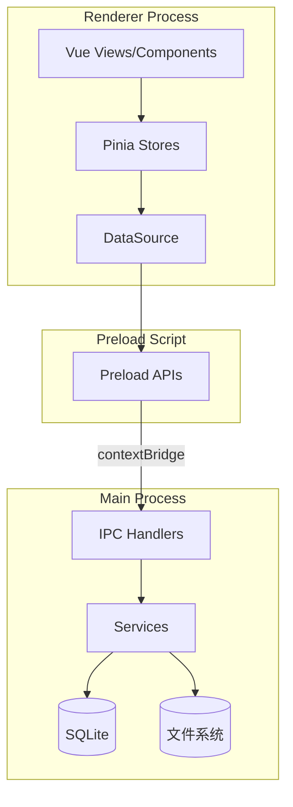
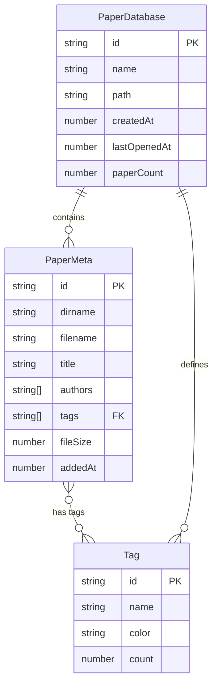
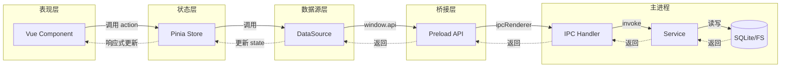
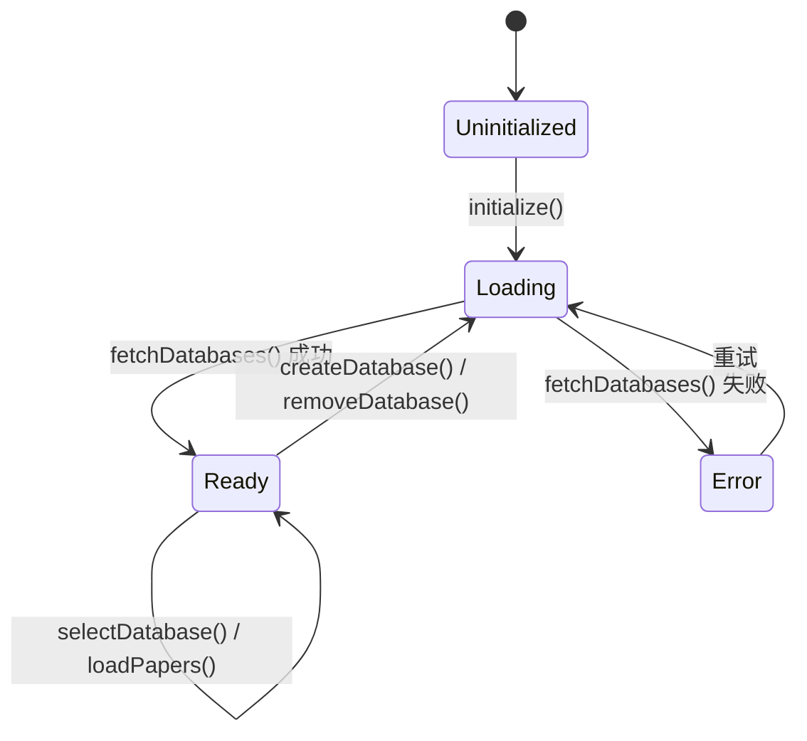
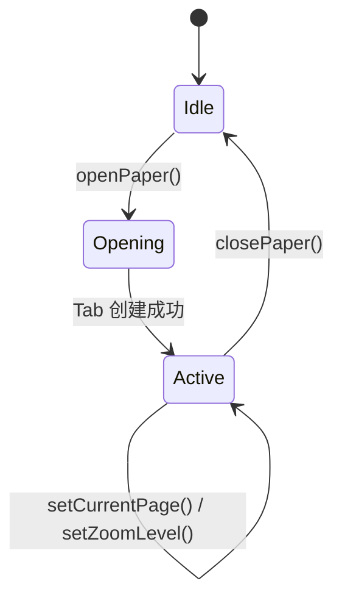
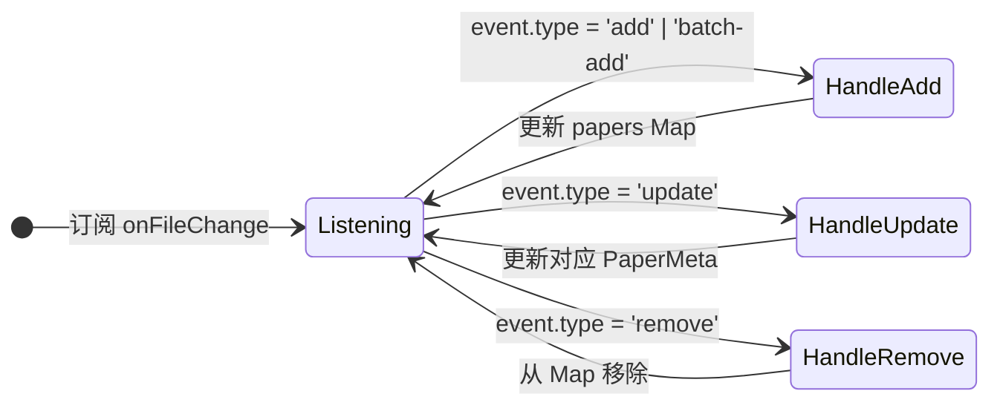
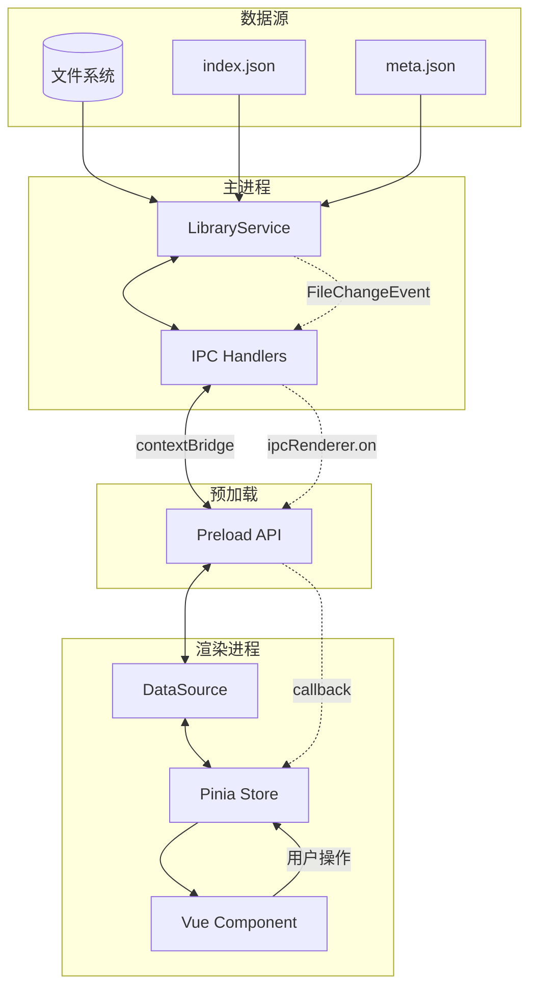
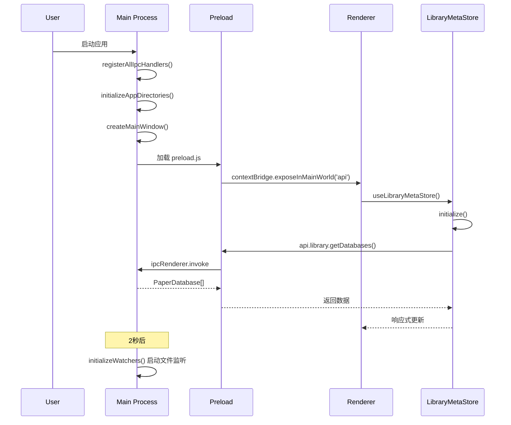
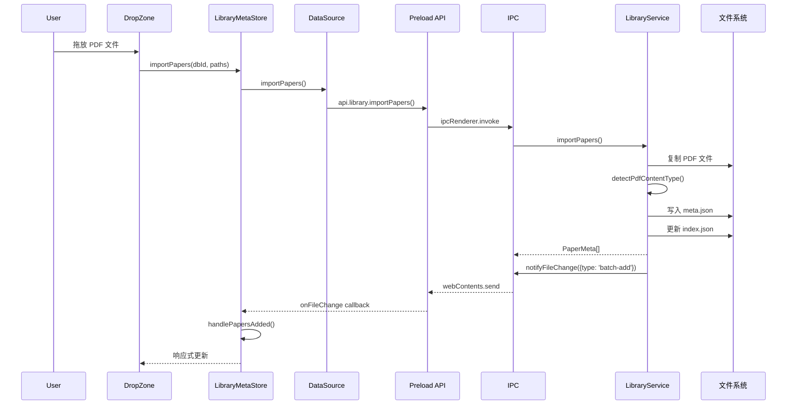
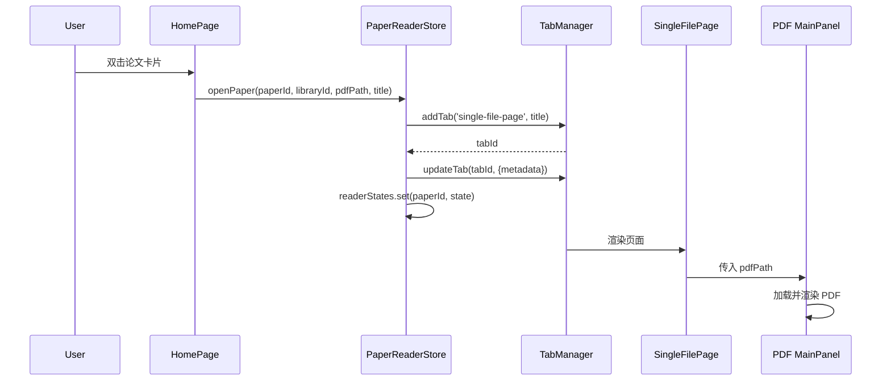

<!-- DEEPWIKI: Prisim-PaperLib -->
<!-- AI-HINT: 使用 Select-String -Pattern "^#" 获取目录结构 -->

# [ROOT] Prisim-PaperLib 技术文档
> 版本: 1.0.0 | 最后更新: 2024-12-01

---

## [VERSION-RECORD]
<!-- 版本记录区 - AI 自动维护 -->
| 序号 | 日期 | Commit | 分支 | 摘要 |
|------|------|--------|------|------|
| 001 | 2024-12-01 | - | main | 初始化文档 - Round 1-5 全部完成 |
<!-- /VERSION-RECORD -->

---

## [TOC] 目录

- [L1] 项目概述
- [L2] 架构总览
- [L3] 数据模型
- [L4] 调用链路
- [L5] 状态机
- [L6] 数据链路
- [L7] 时序图
- [L8] 模块文档
- [L9] API 参考
- [L10] 开发指南
- [L11] 变更日志

---

# [L1] 项目概述

## [L1-01] 项目定位

**Prisim-PaperLib** 是一个基于 Electron + Vue3 + TypeScript 的**学术论文管理桌面应用**，用于管理、阅读和组织 PDF 格式的学术论文。

核心功能：
- 论文库管理（多数据库支持）
- PDF 阅读与浏览
- 标签分类系统
- 文件监听与自动导入

## [L1-02] 技术栈

| 层级 | 技术选型 |
|------|----------|
| **框架** | Electron 38 + Vue 3.5 |
| **语言** | TypeScript 5.9 |
| **状态管理** | Pinia 3.0 |
| **样式** | TailwindCSS 4.1 |
| **构建工具** | electron-vite 4.0 + Vite 7.1 |
| **数据库** | better-sqlite3 |
| **PDF 解析** | pdfjs-dist 4.0 |
| **文件监听** | chokidar 3.6 |

## [L1-03] 目录结构

```
Prisim--PaperLib/
├── apps/
│   ├── client/                 # 前端渲染层
│   │   ├── src/
│   │   │   ├── core/           # 核心服务、类型、工具
│   │   │   │   ├── services/
│   │   │   │   ├── types/
│   │   │   │   └── utils/
│   │   │   ├── renderer/       # Vue 渲染层
│   │   │   │   ├── components/ # 通用组件
│   │   │   │   ├── composables/ # 组合式函数
│   │   │   │   ├── stores/     # Pinia 状态管理
│   │   │   │   ├── styles/     # 全局样式
│   │   │   │   └── views/      # 页面视图
│   │   │   ├── App.vue
│   │   │   └── main.ts
│   │   └── index.html
│   │
│   ├── electron/               # Electron 主进程
│   │   ├── main/
│   │   │   ├── ipc/            # IPC 通信处理器
│   │   │   └── services/       # 后端服务
│   │   └── preload/
│   │       └── apis/           # Preload API 桥接
│   │
│   └── shared/                 # 共享类型定义
│       └── types/
│           ├── ipc-api/        # IPC API 聚合
│           ├── library/        # 论文库类型
│           ├── system/         # 系统配置类型
│           └── window/         # 窗口控制类型
│
├── Script/                     # 开发脚本
├── public/                     # 静态资源
└── resources/                  # 应用资源
```

---

# [L2] 架构总览

## [L2-01] 系统架构图



## [L2-02] 分层设计

| 层级 | 职责 | 目录 |
|------|------|------|
| **表现层** | Vue 组件、页面路由、样式 | `client/src/renderer/views/`, `components/` |
| **状态层** | Pinia Store、响应式状态 | `client/src/renderer/stores/` |
| **数据源层** | DataSource 适配器模式 | `stores/*/xxx.datasource.ts` |
| **桥接层** | Preload API、contextBridge | `electron/preload/apis/` |
| **IPC 层** | IPC Handler、协议定义 | `electron/main/ipc/` |
| **服务层** | 业务逻辑、文件操作 | `electron/main/services/` |
| **持久层** | SQLite、文件系统 | - |

## [L2-03] 进程模型

```
┌─────────────────────────────────────────────────────────────┐
│                      Main Process                            │
│  ┌─────────────┐  ┌─────────────┐  ┌─────────────────────┐  │
│  │ IPC Handlers│  │  Services   │  │   better-sqlite3    │  │
│  └─────────────┘  └─────────────┘  └─────────────────────┘  │
└─────────────────────────────────────────────────────────────┘
         ↕ IPC (contextBridge)
┌─────────────────────────────────────────────────────────────┐
│                    Renderer Process                          │
│  ┌────────────────────────────────────────────────────────┐ │
│  │  Vue 3 + Pinia + TailwindCSS                           │ │
│  │  ┌──────────┐  ┌──────────┐  ┌──────────────────────┐  │ │
│  │  │   Views  │→ │  Stores  │→ │    DataSource        │  │ │
│  │  └──────────┘  └──────────┘  └──────────────────────┘  │ │
│  └────────────────────────────────────────────────────────┘ │
└─────────────────────────────────────────────────────────────┘
```

---

# [L3] 数据模型

## [L3-01] 核心实体

### [L3-01-A] PaperDatabase - 论文库

```typescript
interface PaperDatabase {
  id: string           // 唯一标识
  name: string         // 显示名称
  path: string         // 绝对路径
  createdAt: number    // 创建时间戳
  lastOpenedAt: number // 最后打开时间
  paperCount: number   // 论文数量（缓存）
}
```

### [L3-01-B] PaperMeta - 论文元数据

```typescript
interface PaperMeta {
  id: string              // UUID 短码（8位）
  dirname: string         // 目录名 "Title.a1b2c3d4"
  filename: string        // PDF 文件名
  pdfPath?: string        // PDF 完整路径（运行时填充）
  title: string           // 标题
  authors: string[]       // 作者列表
  year?: number           // 发表年份
  doi?: string            // DOI
  tags: string[]          // 标签 ID 列表
  fileSize: number        // 文件大小（字节）
  addedAt: number         // 添加时间戳
  updatedAt: number       // 更新时间戳
  pdfContentType?: PdfContentType  // PDF 类型
  
  // UI 临时状态
  _isNew?: boolean        // 新添加标记
  _isProcessing?: boolean // 处理中标记
}
```

### [L3-01-C] Tag - 标签

```typescript
interface Tag {
  id: string      // 唯一标识
  name: string    // 标签名
  color?: string  // 颜色
  count: number   // 关联论文数
}
```

### [L3-01-D] AppConfig - 应用配置

```typescript
interface AppConfig {
  paths: {
    appData: string   // 应用数据根目录
    library: string   // 论文库目录
  }
  appearance: {
    theme: 'system' | 'light' | 'dark'
    iconSize: 'small' | 'medium' | 'large'
  }
  startup: {
    openLastPaper: boolean
    autoCheckUpdate: boolean
  }
}
```

## [L3-02] 实体关系图



## [L3-03] 存储结构

### 文件系统结构

```
<library-path>/
├── .prisim/
│   ├── config.json         # 库配置
│   ├── papers.index.json   # 论文索引
│   └── tags.index.json     # 标签索引
├── _imports/               # 导入暂存区
└── <paper-dirname>/        # 论文目录（如 "Title.a1b2c3d4/"）
    └── <paper>.pdf
```

---

# [L4] 调用链路

## [L4-01] 概述

系统采用**分层调用**模式：

```
UI Component → Pinia Store → DataSource → Preload API → IPC Handler → Service → 持久层
```

## [L4-02] 核心链路图



## [L4-03] 链路详解

### [L4-03-A] 链路: 获取论文列表

```
HomePage.vue
  → libraryMetaStore.loadPapers(databaseId)
    → datasource.getPapers(databaseId)
      → window.api.library.getPapers(databaseId)
        → ipcMain.handle('library:getPapers')
          → libraryService.getPapers(databaseId)
            → 读取 papers.index.json
              → 返回 PaperMeta[]
```

### [L4-03-B] 链路: 导入论文

```
DropZone.vue (拖放文件)
  → libraryMetaStore.importPapers(databaseId, filePaths)
    → datasource.importPapers(databaseId, filePaths)
      → window.api.library.importPapers(...)
        → ipcMain.handle('library:importPapers')
          → libraryService.importPapers(...)
            → 复制 PDF 到论文目录
            → 检测 PDF 类型
            → 创建 PaperMeta
            → 更新 papers.index.json
            → 返回 PaperMeta[]
```

---

# [L5] 状态机

## [L5-01] 概述

项目使用 **Pinia** 进行状态管理，核心 Store：
- `library-meta` - 论文库元数据（PaperDatabase[], PaperMeta[]）
- `paper-reader` - PDF 阅读器状态

## [L5-02] 全局状态结构

```
AppState
├── library-meta
│   ├── databases: PaperDatabase[]      # 数据库列表
│   ├── papers: Map<dbId, PaperMeta[]>  # 论文缓存
│   ├── selectedDatabaseId: string      # 当前选中数据库
│   ├── loading: boolean
│   ├── error: Error | null
│   └── initialized: boolean
│
├── paper-reader
│   ├── readerStates: Map<paperId, PaperReaderState>
│   └── activePaperId (computed)
│
└── page-navigation (composable)
    ├── tabs: TabItem[]
    ├── activeTabId: string
    ├── leftSidebarVisible: boolean
    ├── rightSidebarVisible: boolean
    └── leftSidebarWidth / rightSidebarWidth
```

## [L5-03] 状态机图

### [L5-03-A] LibraryMetaStore 状态机



### [L5-03-B] PaperReaderStore 状态机



## [L5-04] FileChangeEvent 处理



---

# [L6] 数据链路

## [L6-01] 概述

数据流采用**单向数据流 + 事件推送**模式：
- **读取**：Component → Store → DataSource → Preload API → IPC → Service → 文件系统
- **写入**：同上 + Service 触发 FileChangeEvent 推送到前端

## [L6-02] 数据流向图



## [L6-03] 数据同步机制

### [L6-03-A] 读取流程

```
1. Component 调用 store.loadPapers(databaseId)
2. Store 调用 dataSource.getPapers(databaseId)
3. DataSource 调用 window.api.library.getPapers()
4. Preload 通过 ipcRenderer.invoke('library:getPapers')
5. IPC Handler 调用 libraryService.getPapers()
6. Service 读取 index.json，填充 pdfPath
7. 数据原路返回，Store 更新 papers Map
8. Vue 响应式更新视图
```

### [L6-03-B] 写入流程

```
1. 用户拖放 PDF 文件
2. Component 调用 store.importPapers(databaseId, filePaths)
3. DataSource → Preload → IPC → Service
4. Service 执行：
   - 复制 PDF 到 papers/<dirname>/
   - 检测 PDF 类型
   - 创建 meta.json
   - 更新 index.json
   - 触发 FileChangeEvent
5. IPC 广播 'library:fileChange' 到所有窗口
6. Preload 回调 onFileChange
7. Store 根据 event.type 更新本地状态
```

### [L6-03-C] DataSource 适配器模式

```typescript
// 接口定义
interface LibraryMetaDataSource {
  getList(): Promise<PaperDatabase[]>
  create(name, path?): Promise<PaperDatabase>
  remove(id, deleteFiles?): Promise<void>
  getPapers(databaseId): Promise<PaperMeta[]>
  importPapers(databaseId, filePaths): Promise<PaperMeta[]>
  subscribeFileChange?(callback): () => void
}

// 实现选择（工厂模式）
function createDataSource(): LibraryMetaDataSource {
  if (forceMock() || !isElectron()) {
    return new LibraryMetaMockDataSource()
  }
  return new LibraryMetaElectronDataSource()
}
```

---

# [L7] 时序图

## [L7-01] 核心场景时序

### [L7-01-A] 应用启动初始化



### [L7-01-B] 导入论文流程



### [L7-01-C] 打开 PDF 阅读



---

# [L8] 模块文档

## [L8-01] library-meta 模块

### [L8-01-A] 职责
管理论文库（PaperDatabase）和论文（PaperMeta）的状态，提供 CRUD 操作和实时同步。

### [L8-01-B] 文件结构
```
stores/library-meta/
├── library-meta.store.ts      # Pinia Store 定义
├── library-meta.datasource.ts # DataSource 接口
├── library-meta.electron.ts   # Electron 实现
└── library-meta.mock.ts       # Mock 实现
```

### [L8-01-C] 状态
| 状态 | 类型 | 说明 |
|------|------|------|
| `databases` | `PaperDatabase[]` | 数据库列表 |
| `papers` | `Map<string, PaperMeta[]>` | 论文缓存（按数据库ID分组） |
| `selectedDatabaseId` | `string \| null` | 当前选中数据库 |
| `loading` | `boolean` | 加载状态 |
| `error` | `Error \| null` | 错误状态 |

### [L8-01-D] Actions
| Action | 说明 |
|--------|------|
| `fetchDatabases()` | 获取数据库列表 |
| `createDatabase(name, path?)` | 创建数据库 |
| `removeDatabase(id, deleteFiles?)` | 删除数据库 |
| `loadPapers(databaseId)` | 加载论文列表 |
| `importPapers(databaseId, filePaths)` | 导入论文 |
| `selectDatabase(id)` | 选中数据库 |

---

## [L8-02] paper-reader 模块

### [L8-02-A] 职责
管理 PDF 阅读器的打开状态、页码、缩放等。

### [L8-02-B] 状态
| 状态 | 类型 | 说明 |
|------|------|------|
| `readerStates` | `Map<string, PaperReaderState>` | 阅读器状态（按 paperId） |
| `activePaperId` | `computed<string \| null>` | 当前激活的论文 ID |

### [L8-02-C] Actions
| Action | 说明 |
|--------|------|
| `openPaper(paperId, libraryId, pdfPath, title)` | 打开论文（创建 Tab） |
| `closePaper(paperId)` | 关闭论文 |
| `setCurrentPage(paperId, page)` | 设置页码 |
| `setZoomLevel(paperId, zoom)` | 设置缩放 |

---

## [L8-03] page-navigation 模块

### [L8-03-A] 职责
Tab 管理、侧边栏控制、右侧栏 Tab 切换。

### [L8-03-B] 组合式函数
| 函数 | 说明 |
|------|------|
| `useTabManager()` | Tab 增删改查 |
| `useSidebarControl()` | 侧边栏显示/隐藏/宽度 |
| `useRightSidebarTab()` | 右侧栏 Tab 切换（notes/ai） |

### [L8-03-C] Tab 类型
```typescript
type TabType = 'home' | 'project' | 'new-tab' | 'settings' | 'single-file-page'
```

---

## [L8-04] LibraryService 模块（主进程）

### [L8-04-A] 职责
论文库核心业务逻辑：文件操作、索引管理、事件通知。

### [L8-04-B] 核心方法
| 方法 | 说明 |
|------|------|
| `getDatabases()` | 获取数据库列表（带校验） |
| `createDatabase(name, path?)` | 创建数据库 |
| `importPapers(databaseId, filePaths)` | 导入论文（含 PDF 类型检测） |
| `rebuildIndex(databaseId)` | 重建索引 |
| `addFileChangeListener(callback)` | 添加文件变更监听器 |

### [L8-04-C] 存储常量
```typescript
const METADATA_DIR = '.metadata'
const PAPERS_DIR = 'papers'
const IMPORTS_DIR = '_imports'
const INDEX_FILE = 'index.json'
const META_FILE = 'meta.json'
```

---

# [L9] API 参考

## [L9-01] IPC API 聚合

IPC API 通过 `window.api` 暴露给渲染进程：

```typescript
interface IpcApi {
  window: WindowApi   // 窗口控制
  system: SystemApi   // 系统配置
  library: LibraryApi // 论文库操作
  utils: UtilsApi     // 工具函数
}
```

## [L9-02] WindowApi

| 方法 | 签名 | 说明 |
|------|------|------|
| `minimize` | `() => void` | 最小化窗口 |
| `maximize` | `() => void` | 最大化/还原窗口 |
| `close` | `() => void` | 关闭窗口 |
| `isMaximized` | `() => Promise<boolean>` | 查询是否最大化 |

## [L9-03] SystemApi

| 方法 | 签名 | 说明 |
|------|------|------|
| `getConfig` | `() => Promise<AppConfig>` | 获取完整配置 |
| `getConfigValue` | `<T>(key: ConfigKey) => Promise<T>` | 获取单个配置项 |
| `setConfigValue` | `<T>(key, value) => Promise<void>` | 设置配置项 |
| `resetConfig` | `() => Promise<void>` | 重置配置 |
| `getPaths` | `() => Promise<AppPaths>` | 获取路径信息 |
| `selectDirectory` | `(title?) => Promise<string \| null>` | 选择目录对话框 |
| `openInExplorer` | `(path) => Promise<void>` | 在资源管理器打开 |

## [L9-04] LibraryApi

### 数据库管理

| 方法 | 签名 | 说明 |
|------|------|------|
| `getDatabases` | `() => Promise<PaperDatabase[]>` | 获取所有数据库 |
| `createDatabase` | `(name, path?) => Promise<PaperDatabase>` | 创建数据库 |
| `openDatabase` | `(id) => Promise<void>` | 打开数据库（启动监听） |
| `closeDatabase` | `(id) => Promise<void>` | 关闭数据库 |
| `removeDatabase` | `(id, deleteFiles?) => Promise<void>` | 删除数据库 |

### 论文操作

| 方法 | 签名 | 说明 |
|------|------|------|
| `getPapers` | `(databaseId) => Promise<PaperMeta[]>` | 获取论文列表 |
| `getPaper` | `(databaseId, paperId) => Promise<PaperMeta \| null>` | 获取单篇论文 |
| `importPapers` | `(databaseId, filePaths) => Promise<PaperMeta[]>` | 导入论文 |
| `removePaper` | `(databaseId, paperId, deleteFile?) => Promise<void>` | 删除论文 |
| `updatePaperMeta` | `(databaseId, paperId, updates) => Promise<void>` | 更新元数据 |

### 标签操作

| 方法 | 签名 | 说明 |
|------|------|------|
| `getTags` | `(databaseId) => Promise<Tag[]>` | 获取标签列表 |
| `createTag` | `(databaseId, name, color?) => Promise<Tag>` | 创建标签 |
| `updateTag` | `(databaseId, tagId, updates) => Promise<void>` | 更新标签 |
| `deleteTag` | `(databaseId, tagId) => Promise<void>` | 删除标签 |

### 事件订阅

| 方法 | 签名 | 说明 |
|------|------|------|
| `onFileChange` | `(callback) => () => void` | 订阅文件变更事件 |
| `onConfirmImport` | `(callback) => () => void` | 订阅导入确认请求 |

---

# [L10] 开发指南

## [L10-01] 环境配置

```bash
# 安装依赖
cd Prisim--PaperLib
pnpm install

# 开发模式（Electron）
pnpm dev

# 纯 Web 开发模式
pnpm dev:web

# 类型检查
pnpm typecheck

# 构建
pnpm build:win    # Windows
pnpm build:mac    # macOS
pnpm build:linux  # Linux
```

## [L10-02] 路径别名

| 别名 | 指向 |
|------|------|
| `@/*` | `apps/client/src/*` |
| `@renderer/*` | `apps/client/src/renderer/*` |
| `@core/*` | `apps/client/src/core/*` |
| `@views/*` | `apps/client/src/renderer/views/*` |
| `@components/*` | `apps/client/src/renderer/components/*` |
| `@stores/*` | `apps/client/src/renderer/stores/*` |
| `@composables/*` | `apps/client/src/renderer/composables/*` |
| `@client&electron.share/*` | `apps/shared/*` |

---

# [L11] 变更日志

## [L11-01] v1.0.0 (2024-12-01)

### [L11-01-A] 初始化
- 创建 DeepWiki 文档
- **Round 1**: 核心架构扫描 - [L1] 项目概述、[L2] 架构总览、[L3] 数据模型、[L9] API 参考、[L10] 开发指南
- **Round 2**: 数据层扫描 - stores/、datasource、composables
- **Round 3**: 表现层扫描 - views/、components/
- **Round 4**: Electron 层扫描 - ipc/、services/、preload/
- **Round 5**: 整合校验 - [L4] 调用链路、[L5] 状态机、[L6] 数据链路、[L7] 时序图、[L8] 模块文档
