<!-- DEEPWIKI: Prisim-PaperLib -->
<!-- AI-HINT: 使用 Select-String -Pattern "^#" 获取目录结构 -->

# [ROOT] Prisim-PaperLib 技术文档
> 版本: 1.1.0 | 最后更新: 2024-12-02

---

## [VERSION-RECORD]
<!-- 版本记录区 - AI 自动维护 -->
| 序号 | 日期 | Commit | 分支 | 摘要 |
|------|------|--------|------|------|
| 001 | 2024-12-01 | - | main | 初始化文档 - Round 1-5 全部完成 |
| 002 | 2024-12-02 | 1b5933a | main | 集成 MinerU OCR 功能 |
<!-- /VERSION-RECORD -->

---

## [TOC] 目录

- [L1] 项目概述
- [L2] 架构总览
- [L3] 数据模型
- [L4] 调用链路
- [L5] 状态机
- [L6] 数据链路
- [L7] 时序图
- [L8] 模块文档
- [L9] API 参考
- [L10] 开发指南
- [L11] 变更日志

---

# [L1] 项目概述

## [L1-01] 项目定位

**Prisim-PaperLib** 是一个基于 Electron + Vue3 + TypeScript 的**学术论文管理桌面应用**，用于管理、阅读和组织 PDF 格式的学术论文。

核心功能：
- 论文库管理（多数据库支持）
- PDF 阅读与浏览
- 标签分类系统
- 文件监听与自动导入

## [L1-02] 技术栈

| 层级 | 技术选型 |
|------|----------|
| **框架** | Electron 38 + Vue 3.5 |
| **语言** | TypeScript 5.9 |
| **状态管理** | Pinia 3.0 |
| **样式** | TailwindCSS 4.1 |
| **构建工具** | electron-vite 4.0 + Vite 7.1 |
| **数据库** | better-sqlite3 |
| **PDF 解析** | pdfjs-dist 4.0 |
| **文件监听** | chokidar 3.6 |
| **OCR 服务** | MinerU API v4 |

## [L1-03] 目录结构

```
Prisim--PaperLib/
├── apps/
│   ├── client/                 # 前端渲染层
│   │   ├── src/
│   │   │   ├── core/           # 核心服务、类型、工具
│   │   │   │   ├── services/
│   │   │   │   ├── types/
│   │   │   │   └── utils/
│   │   │   ├── renderer/       # Vue 渲染层
│   │   │   │   ├── components/ # 通用组件
│   │   │   │   ├── composables/ # 组合式函数
│   │   │   │   ├── stores/     # Pinia 状态管理
│   │   │   │   ├── styles/     # 全局样式
│   │   │   │   └── views/      # 页面视图
│   │   │   ├── App.vue
│   │   │   └── main.ts
│   │   └── index.html
│   │
│   ├── electron/               # Electron 主进程
│   │   ├── main/
│   │   │   ├── ipc/            # IPC 通信处理器
│   │   │   └── services/       # 后端服务
│   │   └── preload/
│   │       └── apis/           # Preload API 桥接
│   │
│   └── shared/                 # 共享类型定义
│       └── types/
│           ├── ipc-api/        # IPC API 聚合
│           ├── library/        # 论文库类型
│           ├── system/         # 系统配置类型
│           └── window/         # 窗口控制类型
│
├── Script/                     # 开发脚本
├── public/                     # 静态资源
└── resources/                  # 应用资源
```

---

# [L2] 架构总览

## [L2-01] 系统总架构图

```mermaid
%%{init: {'theme':'base', 'themeVariables': { 'primaryColor':'#e3f2fd','primaryTextColor':'#1565c0','primaryBorderColor':'#1976d2','lineColor':'#64b5f6','secondaryColor':'#f3e5f5','tertiaryColor':'#fff3e0','fontSize':'14px'}}}%%
graph TB
    subgraph UI["🖥️ 用户界面层"]
        direction LR
        HomePage["📚 主页<br/><small>论文库列表</small>"]
        SingleFile["📄 单文件阅读页<br/><small>PDF 阅读器</small>"]
        Settings["⚙️ 设置页<br/><small>通用/扩展</small>"]
        ProgressDialog["📊 进度对话框<br/><small>任务监控</small>"]
    end
    
    subgraph State["📦 状态管理层 (Pinia)"]
        direction LR
        LibraryStore["LibraryMetaStore<br/><small>论文库元数据</small>"]
        ReaderStore["PaperReaderStore<br/><small>阅读器状态</small>"]
        MineruStore["MineruTaskStore<br/><small>OCR 任务</small>"]
    end
    
    subgraph DataSource["🔌 数据源层"]
        direction LR
        LibraryDS["LibraryDataSource<br/><small>Electron/Mock</small>"]
        MineruDS["MineruDataSource<br/><small>Electron</small>"]
    end
    
    subgraph Bridge["🌉 桥接层 (Preload)"]
        direction LR
        LibraryAPI["LibraryApi"]
        SystemAPI["SystemApi"]
        MineruAPI["MineruApi"]
    end
    
    subgraph IPC["📡 IPC 通信层"]
        direction LR
        LibraryIPC["library.ipc.ts"]
        SystemIPC["system.ipc.ts"]
        MineruIPC["mineru.ipc.ts"]
    end
    
    subgraph Service["⚙️ 服务层 (Main Process)"]
        direction LR
        LibraryService["LibraryService<br/><small>论文管理</small>"]
        SystemService["SystemService<br/><small>配置管理</small>"]
        MineruService["MineruService<br/><small>OCR 服务</small>"]
        WatcherService["WatcherService<br/><small>文件监听</small>"]
    end
    
    subgraph Storage["💾 持久化层"]
        direction LR
        SQLite[("📊 SQLite<br/><small>papers.index.json</small>")]
        FileSystem[("📁 文件系统<br/><small>PDF 文件</small>")]
        Config[("⚙️ 配置文件<br/><small>System.config.json</small>")]
        MineruCache[("💾 任务缓存<br/><small>.mineru-tasks.json</small>")]
    end
    
    subgraph External["🌐 外部服务"]
        direction LR
        MineruAPI_External["🔮 MinerU API<br/><small>mineru.net</small>"]
        OSS["☁️ 阿里云 OSS<br/><small>文件上传</small>"]
    end
    
    %% UI → State (粗实线)
    HomePage ==> LibraryStore
    SingleFile ==> ReaderStore
    SingleFile ==> MineruStore
    Settings ==> MineruStore
    ProgressDialog ==> MineruStore
    
    %% State → DataSource (粗实线)
    LibraryStore ==> LibraryDS
    MineruStore ==> MineruDS
    
    %% DataSource → Bridge (曲线)
    LibraryDS -.-> LibraryAPI
    MineruDS -.-> MineruAPI
    MineruDS -.-> SystemAPI
    
    %% Bridge → IPC (虚线标注)
    LibraryAPI -.-|"🔒 contextBridge"| LibraryIPC
    SystemAPI -.-|"🔒 contextBridge"| SystemIPC
    MineruAPI -.-|"🔒 contextBridge"| MineruIPC
    
    %% IPC → Service (粗实线)
    LibraryIPC ==> LibraryService
    SystemIPC ==> SystemService
    MineruIPC ==> MineruService
    
    %% Service → Storage (实线)
    LibraryService --> SQLite
    LibraryService --> FileSystem
    SystemService --> Config
    MineruService --> MineruCache
    
    %% Service → External (粗虚线)
    MineruService ==o MineruAPI_External
    MineruService ==o OSS
    
    %% Watcher → Service (双向)
    WatcherService <--> LibraryService
    FileSystem -.-|"👁️ 监听"| WatcherService
    
    %% 事件反向通知 (虚线箭头)
    LibraryService -.->|"📢 事件广播"| LibraryIPC
    MineruService -.->|"📢 任务更新"| MineruIPC
    
    %% 样式定义
    classDef uiClass fill:#e3f2fd,stroke:#1976d2,stroke-width:3px,color:#0d47a1,rx:10,ry:10
    classDef stateClass fill:#f3e5f5,stroke:#7b1fa2,stroke-width:3px,color:#4a148c,rx:10,ry:10
    classDef bridgeClass fill:#e0f7fa,stroke:#00838f,stroke-width:2px,color:#006064,rx:8,ry:8
    classDef ipcClass fill:#fff9c4,stroke:#f57f17,stroke-width:2px,color:#f57f17,rx:8,ry:8
    classDef serviceClass fill:#fff3e0,stroke:#f57c00,stroke-width:3px,color:#e65100,rx:10,ry:10
    classDef storageClass fill:#e8f5e9,stroke:#388e3c,stroke-width:3px,color:#1b5e20,rx:15,ry:15
    classDef externalClass fill:#fce4ec,stroke:#c2185b,stroke-width:3px,color:#880e4f,rx:10,ry:10
    
    class HomePage,SingleFile,Settings,ProgressDialog uiClass
    class LibraryStore,ReaderStore,MineruStore stateClass
    class LibraryDS,MineruDS bridgeClass
    class LibraryAPI,SystemAPI,MineruAPI bridgeClass
    class LibraryIPC,SystemIPC,MineruIPC ipcClass
    class LibraryService,SystemService,MineruService,WatcherService serviceClass
    class SQLite,FileSystem,Config,MineruCache storageClass
    class MineruAPI_External,OSS externalClass
```

## [L2-02] 技术架构图

```mermaid
%%{init: {'theme':'base', 'themeVariables': { 'primaryColor':'#f5f5f7','primaryTextColor':'#1d1d1f','primaryBorderColor':'#86868b','lineColor':'#0071e3','secondaryColor':'#fafafa','tertiaryColor':'#ffffff','fontSize':'15px','fontFamily':'SF Pro Display, -apple-system, sans-serif'}}}%%
graph TB
    subgraph Renderer["🎨 渲染进程 (Renderer Process)"]
        V["Vue Views<br/><small>组件层</small>"]
        S["Pinia Stores<br/><small>状态管理</small>"]
        DS["DataSource<br/><small>数据适配</small>"]
    end
    
    subgraph Preload["🔐 预加载脚本 (Preload Script)"]
        API["Preload APIs<br/><small>安全桥接</small>"]
    end
    
    subgraph Main["⚡ 主进程 (Main Process)"]
        IPC["IPC Handlers<br/><small>通信处理</small>"]
        SVC["Services<br/><small>业务逻辑</small>"]
        DB[("💾 SQLite<br/><small>结构化数据</small>")]
        FS[("📁 FileSystem<br/><small>文件存储</small>")]
    end
    
    V ==> S
    S ==> DS
    DS -.-> API
    API -.-|"🔒 contextBridge"| IPC
    IPC ==> SVC
    SVC --> DB
    SVC --> FS
    
    classDef rendererClass fill:#e8f4fd,stroke:#0071e3,stroke-width:2.5px,color:#1d1d1f,rx:12,ry:12
    classDef preloadClass fill:#fff4e6,stroke:#ff9500,stroke-width:2.5px,color:#1d1d1f,rx:12,ry:12
    classDef mainClass fill:#f0f0f5,stroke:#5e5ce6,stroke-width:2.5px,color:#1d1d1f,rx:12,ry:12
    classDef storageClass fill:#e8f5e9,stroke:#34c759,stroke-width:2.5px,color:#1d1d1f,rx:16,ry:16
    
    class V,S,DS rendererClass
    class API preloadClass
    class IPC,SVC mainClass
    class DB,FS storageClass
```

## [L2-03] 分层设计

| 🎨 层级 | 📋 职责 | 📂 目录 |
|--------|--------|--------|
| **表现层** | Vue 组件、页面路由、样式 | `client/src/renderer/views/`, `components/` |
| **状态层** | Pinia Store、响应式状态 | `client/src/renderer/stores/` |
| **数据源层** | DataSource 适配器模式 | `stores/*/xxx.datasource.ts` |
| **桥接层** | Preload API、contextBridge | `electron/preload/apis/` |
| **IPC 层** | IPC Handler、协议定义 | `electron/main/ipc/` |
| **服务层** | 业务逻辑、文件操作 | `electron/main/services/` |
| **持久层** | SQLite、文件系统 | - |

## [L2-04] 进程模型

```
┌─────────────────────────────────────────────────────────────┐
│                      Main Process                            │
│  ┌─────────────┐  ┌─────────────┐  ┌─────────────────────┐  │
│  │ IPC Handlers│  │  Services   │  │   better-sqlite3    │  │
│  └─────────────┘  └─────────────┘  └─────────────────────┘  │
└─────────────────────────────────────────────────────────────┘
         ↕ IPC (contextBridge)
┌─────────────────────────────────────────────────────────────┐
│                    Renderer Process                          │
│  ┌────────────────────────────────────────────────────────┐ │
│  │  Vue 3 + Pinia + TailwindCSS                           │ │
│  │  ┌──────────┐  ┌──────────┐  ┌──────────────────────┐  │ │
│  │  │   Views  │→ │  Stores  │→ │    DataSource        │  │ │
│  │  └──────────┘  └──────────┘  └──────────────────────┘  │ │
│  └────────────────────────────────────────────────────────┘ │
└─────────────────────────────────────────────────────────────┘
```

---

# [L3] 数据模型

## [L3-01] 核心实体

### [L3-01-A] PaperDatabase - 论文库

```typescript
interface PaperDatabase {
  id: string           // 唯一标识
  name: string         // 显示名称
  path: string         // 绝对路径
  createdAt: number    // 创建时间戳
  lastOpenedAt: number // 最后打开时间
  paperCount: number   // 论文数量（缓存）
}
```

### [L3-01-B] PaperMeta - 论文元数据

```typescript
interface PaperMeta {
  id: string              // UUID 短码（8位）
  dirname: string         // 目录名 "Title.a1b2c3d4"
  filename: string        // PDF 文件名
  pdfPath?: string        // PDF 完整路径（运行时填充）
  title: string           // 标题
  authors: string[]       // 作者列表
  year?: number           // 发表年份
  doi?: string            // DOI
  tags: string[]          // 标签 ID 列表
  fileSize: number        // 文件大小（字节）
  addedAt: number         // 添加时间戳
  updatedAt: number       // 更新时间戳
  pdfContentType?: PdfContentType  // PDF 类型
  
  // UI 临时状态
  _isNew?: boolean        // 新添加标记
  _isProcessing?: boolean // 处理中标记
}
```

### [L3-01-C] Tag - 标签

```typescript
interface Tag {
  id: string      // 唯一标识
  name: string    // 标签名
  color?: string  // 颜色
  count: number   // 关联论文数
}
```

### [L3-01-D] AppConfig - 应用配置

```typescript
interface AppConfig {
  paths: {
    appData: string   // 应用数据根目录
    library: string   // 论文库目录
  }
  appearance: {
    theme: 'system' | 'light' | 'dark'
    iconSize: 'small' | 'medium' | 'large'
  }
  startup: {
    openLastPaper: boolean
    autoCheckUpdate: boolean
  }
  extensions?: {
    mineru?: MineruConfig  // MinerU OCR 配置
  }
}

interface MineruConfig {
  apiKey: string
  modelVersion: 'pipeline' | 'vlm'
  enableOcr: boolean
  enableFormula: boolean
  enableTable: boolean
  language: string
  pollingIntervalSec: number
}
```

### [L3-01-E] MineruTask - OCR 任务

```typescript
interface MineruTask {
  localId: string              // 本地任务 ID
  paperId: string              // 关联论文 ID
  fileName: string             // 文件名
  pdfPath: string              // 本地 PDF 路径
  batchId: string              // MinerU 批次 ID
  dataId: string               // 数据 ID
  state: MineruTaskState       // 任务状态
  progress?: MineruTaskProgress // 解析进度
  resultZipUrl?: string        // 结果下载 URL
  resultLocalPath?: string     // 本地结果路径
  errorMsg?: string            // 错误信息
  createdAt: number            // 创建时间戳
  updatedAt: number            // 更新时间戳
}

type MineruTaskState = 'uploading' | 'pending' | 'running' | 'done' | 'failed'
```

## [L3-02] 实体关系图

```mermaid
%%{init: {'theme':'base', 'themeVariables': { 'primaryColor':'#f5f5f7','primaryTextColor':'#1d1d1f','primaryBorderColor':'#0071e3','lineColor':'#0071e3','secondaryColor':'#e8f4fd','tertiaryColor':'#fff4e6','fontSize':'14px','fontFamily':'SF Pro Text, -apple-system, sans-serif'}}}%%
erDiagram
    PaperDatabase ||--o{ PaperMeta : "📚 contains"
    PaperMeta }o--o{ Tag : "🏷️ has tags"
    PaperDatabase ||--o{ Tag : "🎨 defines"
    PaperMeta ||--o{ MineruTask : "🔮 ocr tasks"
    
    PaperDatabase {
        string id PK "唯一标识"
        string name "库名称"
        string path "存储路径"
        number createdAt "创建时间"
        number lastOpenedAt "最后打开"
        number paperCount "论文数量"
    }
    
    PaperMeta {
        string id PK "论文ID"
        string dirname "目录名"
        string filename "文件名"
        string title "标题"
        string[] authors "作者列表"
        string[] tags FK "标签ID"
        number fileSize "文件大小"
        number addedAt "添加时间"
    }
    
    Tag {
        string id PK "标签ID"
        string name "标签名"
        string color "颜色值"
        number count "引用计数"
    }
    
    MineruTask {
        string localId PK "本地任务ID"
        string paperId FK "关联论文"
        string batchId "批次ID"
        string state "任务状态"
        string resultZipUrl "结果URL"
        number createdAt "创建时间"
    }
```

## [L3-03] 存储结构

### 📁 文件系统结构

```
📂 <library-path>/
├── 🗂️ .prisim/
│   ├── ⚙️ config.json         # 库配置
│   ├── 📊 papers.index.json   # 论文索引
│   └── 🏷️ tags.index.json     # 标签索引
├── 📥 _imports/               # 导入暂存区
└── 📄 <paper-dirname>/        # 论文目录（如 "Title.a1b2c3d4/"）
    └── 📋 <paper>.pdf
```

---

# [L4] 调用链路

## [L4-01] 概述

系统采用**分层调用**模式：

```
UI Component → Pinia Store → DataSource → Preload API → IPC Handler → Service → 持久层
```

## [L4-02] 核心链路图

```mermaid
%%{init: {'theme':'base', 'themeVariables': { 'primaryColor':'#f5f5f7','primaryTextColor':'#1d1d1f','primaryBorderColor':'#86868b','lineColor':'#0071e3','secondaryColor':'#e8f4fd','tertiaryColor':'#fff4e6','fontSize':'14px','fontFamily':'SF Pro Text, -apple-system, sans-serif'}}}%%
graph LR
    subgraph UI["🎨 表现层"]
        A["Vue Component<br/><small>用户交互</small>"]
    end
    subgraph State["📦 状态层"]
        B["Pinia Store<br/><small>状态管理</small>"]
    end
    subgraph DS["🔌 数据源层"]
        C["DataSource<br/><small>适配器</small>"]
    end
    subgraph Bridge["🌉 桥接层"]
        D["Preload API<br/><small>安全桥接</small>"]
    end
    subgraph Main["⚡ 主进程"]
        E["IPC Handler<br/><small>通信处理</small>"]
        F["Service<br/><small>业务逻辑</small>"]
        G[("💾 Storage<br/><small>SQLite/FS</small>")]
    end
    
    A ==|"1️⃣ 调用 action"| B
    B ==|"2️⃣ 调用方法"| C
    C -.->|"3️⃣ window.api"| D
    D -.-|"4️⃣ ipcRenderer"| E
    E ==>|"5️⃣ invoke"| F
    F -->|"6️⃣ 读写"| G
    G -.->|"7️⃣ 返回数据"| F
    F -.->|"8️⃣ 返回结果"| E
    E -.->|"9️⃣ 返回响应"| D
    D -.->|"🔟 返回数据"| C
    C -.->|"1️⃣1️⃣ 更新 state"| B
    B -.->|"1️⃣2️⃣ 响应式更新"| A
    
    classDef uiClass fill:#e8f4fd,stroke:#0071e3,stroke-width:2.5px,color:#1d1d1f,rx:12,ry:12
    classDef stateClass fill:#f3e5f5,stroke:#7b1fa2,stroke-width:2.5px,color:#1d1d1f,rx:12,ry:12
    classDef dsClass fill:#e0f7fa,stroke:#00838f,stroke-width:2.5px,color:#1d1d1f,rx:12,ry:12
    classDef bridgeClass fill:#fff4e6,stroke:#ff9500,stroke-width:2.5px,color:#1d1d1f,rx:12,ry:12
    classDef mainClass fill:#f0f0f5,stroke:#5e5ce6,stroke-width:2.5px,color:#1d1d1f,rx:12,ry:12
    classDef storageClass fill:#e8f5e9,stroke:#34c759,stroke-width:2.5px,color:#1d1d1f,rx:16,ry:16
    
    class A uiClass
    class B stateClass
    class C dsClass
    class D bridgeClass
    class E,F mainClass
    class G storageClass
```

## [L4-03] 链路详解

### [L4-03-A] 链路: 获取论文列表

```
📄 HomePage.vue
  → 📦 libraryMetaStore.loadPapers(databaseId)
    → 🔌 datasource.getPapers(databaseId)
      → 🌉 window.api.library.getPapers(databaseId)
        → 📡 ipcMain.handle('library:getPapers')
          → ⚙️ libraryService.getPapers(databaseId)
            → 📊 读取 papers.index.json
              → 📬 返回 PaperMeta[]
```

### [L4-03-B] 链路: 导入论文

```
📂 DropZone.vue (拖放文件)
  → 📦 libraryMetaStore.importPapers(databaseId, filePaths)
    → 🔌 datasource.importPapers(databaseId, filePaths)
      → 🌉 window.api.library.importPapers(...)
        → 📡 ipcMain.handle('library:importPapers')
          → libraryService.importPapers(...)
            → 复制 PDF 到论文目录
            → 检测 PDF 类型
            → 创建 PaperMeta
            → 更新 papers.index.json
            → 返回 PaperMeta[]
```

---

# [L5] 状态机

## [L5-01] 概述

项目使用 **Pinia** 进行状态管理，核心 Store：
- `library-meta` - 论文库元数据（PaperDatabase[], PaperMeta[]）
- `paper-reader` - PDF 阅读器状态
- `mineru-task` - MinerU OCR 任务状态

## [L5-02] 全局状态结构

```
AppState
├── library-meta
│   ├── databases: PaperDatabase[]      # 数据库列表
│   ├── papers: Map<dbId, PaperMeta[]>  # 论文缓存
│   ├── selectedDatabaseId: string      # 当前选中数据库
│   ├── loading: boolean
│   ├── error: Error | null
│   └── initialized: boolean
│
├── paper-reader
│   ├── readerStates: Map<paperId, PaperReaderState>
│   └── activePaperId (computed)
│
├── mineru-task
│   ├── tasks: Map<localId, MineruTask>  # 任务映射
│   ├── loading: boolean
│   ├── error: Error | null
│   ├── initialized: boolean
│   ├── taskList (computed)              # 任务列表
│   ├── activeTasks (computed)           # 活跃任务
│   └── globalProgress (computed)        # 全局进度统计
│
└── page-navigation (composable)
    ├── tabs: TabItem[]
    ├── activeTabId: string
    ├── leftSidebarVisible: boolean
    ├── rightSidebarVisible: boolean
    └── leftSidebarWidth / rightSidebarWidth
```

## [L5-03] 状态机图

### [L5-03-A] LibraryMetaStore 状态机

```mermaid
%%{init: {'theme':'base', 'themeVariables': { 'primaryColor':'#e8f4fd','primaryTextColor':'#1d1d1f','primaryBorderColor':'#0071e3','lineColor':'#0071e3','fontSize':'14px','fontFamily':'SF Pro Text, -apple-system, sans-serif'}}}%%
stateDiagram-v2
    [*] --> Uninitialized: 🚀 启动
    Uninitialized --> Loading : 📥 initialize()
    Loading --> Ready : ✅ fetchDatabases() 成功
    Loading --> Error : ❌ fetchDatabases() 失败
    Ready --> Loading : 🔄 createDatabase() / removeDatabase()
    Ready --> Ready : 📂 selectDatabase() / loadPapers()
    Error --> Loading : 🔁 重试
    Ready --> [*] : 🛑 销毁
```

### [L5-03-B] PaperReaderStore 状态机

```mermaid
%%{init: {'theme':'base', 'themeVariables': { 'primaryColor':'#f3e5f5','primaryTextColor':'#1d1d1f','primaryBorderColor':'#7b1fa2','lineColor':'#7b1fa2','fontSize':'14px','fontFamily':'SF Pro Text, -apple-system, sans-serif'}}}%%
stateDiagram-v2
    [*] --> Idle: 💤 空闲
    Idle --> Opening : 📖 openPaper()
    Opening --> Active : ✅ Tab 创建成功
    Active --> Active : 📄 setCurrentPage()<br/>🔍 setZoomLevel()
    Active --> Idle : ❌ closePaper()
    Idle --> [*] : 🛑 销毁
```

### [L5-03-C] MineruTaskStore 状态机

```mermaid
%%{init: {'theme':'base', 'themeVariables': { 'primaryColor':'#fff4e6','primaryTextColor':'#1d1d1f','primaryBorderColor':'#ff9500','lineColor':'#ff9500','fontSize':'14px','fontFamily':'SF Pro Text, -apple-system, sans-serif'}}}%%
stateDiagram-v2
    [*] --> Uninitialized: 🚀 启动
    Uninitialized --> Loading : 📥 initialize()
    Loading --> Ready : ✅ 加载缓存成功
    Ready --> Uploading : 📤 submitLocalOcrTask()
    Uploading --> Pending : ✅ 文件上传成功
    Pending --> Running : 🔄 MinerU 开始处理
    Running --> Done : ✅ 解析完成
    Running --> Failed : ❌ 解析失败
    Done --> Ready : 📥 downloadResult()
    Failed --> Ready : 🔄 清除失败任务
    Ready --> [*] : 🛑 销毁
```

## [L5-04] FileChangeEvent 处理

```mermaid
stateDiagram-v2
    direction LR
    [*] --> Listening : 订阅 onFileChange
    Listening --> HandleAdd : event.type = 'add' | 'batch-add'
    Listening --> HandleUpdate : event.type = 'update'
    Listening --> HandleRemove : event.type = 'remove'
    HandleAdd --> Listening : 更新 papers Map
    HandleUpdate --> Listening : 更新对应 PaperMeta
    HandleRemove --> Listening : 从 Map 移除
```

---

# [L6] 数据链路

## [L6-01] 概述

数据流采用**单向数据流 + 事件推送**模式：
- **读取**：Component → Store → DataSource → Preload API → IPC → Service → 文件系统
- **写入**：同上 + Service 触发 FileChangeEvent 推送到前端

## [L6-02] 数据流向图

```mermaid
flowchart TD
    subgraph 数据源
        S1[(文件系统)]
        S2[index.json]
        S3[meta.json]
    end
    
    subgraph 主进程
        SVC[LibraryService]
        IPC[IPC Handlers]
    end
    
    subgraph 预加载
        API[Preload API]
    end
    
    subgraph 渲染进程
        DS[DataSource]
        Store[Pinia Store]
        View[Vue Component]
    end
    
    S1 & S2 & S3 --> SVC
    SVC <--> IPC
    IPC <-->|contextBridge| API
    API <--> DS
    DS <--> Store
    Store --> View
    View -->|用户操作| Store
    
    SVC -.->|FileChangeEvent| IPC
    IPC -.->|ipcRenderer.on| API
    API -.->|callback| Store
```

## [L6-03] 数据同步机制

### [L6-03-A] 读取流程

```
1. Component 调用 store.loadPapers(databaseId)
2. Store 调用 dataSource.getPapers(databaseId)
3. DataSource 调用 window.api.library.getPapers()
4. Preload 通过 ipcRenderer.invoke('library:getPapers')
5. IPC Handler 调用 libraryService.getPapers()
6. Service 读取 index.json，填充 pdfPath
7. 数据原路返回，Store 更新 papers Map
8. Vue 响应式更新视图
```

### [L6-03-B] 写入流程

```
1. 用户拖放 PDF 文件
2. Component 调用 store.importPapers(databaseId, filePaths)
3. DataSource → Preload → IPC → Service
4. Service 执行：
   - 复制 PDF 到 papers/<dirname>/
   - 检测 PDF 类型
   - 创建 meta.json
   - 更新 index.json
   - 触发 FileChangeEvent
5. IPC 广播 'library:fileChange' 到所有窗口
6. Preload 回调 onFileChange
7. Store 根据 event.type 更新本地状态
```

### [L6-03-C] DataSource 适配器模式

```typescript
// 接口定义
interface LibraryMetaDataSource {
  getList(): Promise<PaperDatabase[]>
  create(name, path?): Promise<PaperDatabase>
  remove(id, deleteFiles?): Promise<void>
  getPapers(databaseId): Promise<PaperMeta[]>
  importPapers(databaseId, filePaths): Promise<PaperMeta[]>
  subscribeFileChange?(callback): () => void
}

// 实现选择（工厂模式）
function createDataSource(): LibraryMetaDataSource {
  if (forceMock() || !isElectron()) {
    return new LibraryMetaMockDataSource()
  }
  return new LibraryMetaElectronDataSource()
}
```

---

# [L7] 时序图

## [L7-01] 核心场景时序

### [L7-01-A] 应用启动初始化

```mermaid
%%{init: {'theme':'base', 'themeVariables': { 'primaryColor':'#f5f5f7','primaryTextColor':'#1d1d1f','primaryBorderColor':'#86868b','lineColor':'#0071e3','secondaryColor':'#e8f4fd','tertiaryColor':'#fff4e6','fontSize':'14px','fontFamily':'SF Pro Text, -apple-system, sans-serif'}}}%%
sequenceDiagram
    participant User as 👤 用户
    participant Main as ⚡ 主进程
    participant Preload as 🌉 预加载
    participant Renderer as 🎨 渲染进程
    participant Store as 📦 Store
    
    User->>Main: 🚀 启动应用
    Main->>Main: 📡 registerAllIpcHandlers()
    Main->>Main: 📁 initializeAppDirectories()
    Main->>Main: 🪟 createMainWindow()
    Main->>Preload: 📜 加载 preload.js
    Preload->>Renderer: 🔗 contextBridge.exposeInMainWorld('api')
    Renderer->>Store: 🏪 useLibraryMetaStore()
    Store->>Store: 📥 initialize()
    Store->>Preload: 🔍 api.library.getDatabases()
    Preload->>Main: 📡 ipcRenderer.invoke
    Main-->>Preload: 📊 PaperDatabase[]
    Preload-->>Store: 📬 返回数据
    Store-->>Renderer: 🔄 响应式更新
    Note over Main: ⏰ 2秒后
    Main->>Main: 👁️ initializeWatchers() 启动文件监听
```

### [L7-01-B] 导入论文流程

```mermaid
%%{init: {'theme':'base', 'themeVariables': { 'primaryColor':'#f5f5f7','primaryTextColor':'#1d1d1f','primaryBorderColor':'#86868b','lineColor':'#0071e3','secondaryColor':'#e8f4fd','tertiaryColor':'#fff4e6','fontSize':'14px','fontFamily':'SF Pro Text, -apple-system, sans-serif'}}}%%
sequenceDiagram
    participant User as 👤 用户
    participant DropZone as 📂 拖放区
    participant Store as 📦 Store
    participant DS as 🔌 DataSource
    participant API as 🌉 Preload API
    participant IPC as 📡 IPC
    participant Service as ⚙️ Service
    participant FS as 📁 文件系统
    
    User->>DropZone: 📤 拖放 PDF 文件
    DropZone->>Store: 📋 importPapers(dbId, paths)
    Store->>DS: 📞 importPapers()
    DS->>API: 🔍 api.library.importPapers()
    API->>IPC: 📡 ipcRenderer.invoke
    IPC->>Service: 📋 importPapers()
    Service->>FS: 📋 复制 PDF 文件
    Service->>Service: 🔍 detectPdfContentType()
    Service->>FS: 📝 写入 meta.json
    Service->>FS: 📊 更新 index.json
    Service-->>IPC: 📊 PaperMeta[]
    Service->>IPC: 📢 notifyFileChange({type: 'batch-add'})
    IPC-->>API: webContents.send
    API-->>Store: onFileChange callback
    Store->>Store: handlePapersAdded()
    Store-->>DropZone: 响应式更新
```

### [L7-01-C] 打开 PDF 阅读

```mermaid
%%{init: {'theme':'base', 'themeVariables': { 'primaryColor':'#f5f5f7','primaryTextColor':'#1d1d1f','primaryBorderColor':'#86868b','lineColor':'#0071e3','secondaryColor':'#e8f4fd','tertiaryColor':'#fff4e6','fontSize':'14px','fontFamily':'SF Pro Text, -apple-system, sans-serif'}}}%%
sequenceDiagram
    participant User as 👤 用户
    participant HomePage as 📚 主页
    participant ReaderStore as 📖 ReaderStore
    participant TabManager as 📑 TabManager
    participant SingleFilePage as 📄 单文件页
    participant MainPanel as 📋 PDF MainPanel
    
    User->>HomePage: 👆 双击论文卡片
    HomePage->>ReaderStore: 📖 openPaper(paperId, libraryId, pdfPath, title)
    ReaderStore->>TabManager: ➕ addTab('single-file-page', title)
    TabManager-->>ReaderStore: 🆔 tabId
    ReaderStore->>TabManager: 📝 updateTab(tabId, {metadata})
    ReaderStore->>ReaderStore: 💾 readerStates.set(paperId, state)
    TabManager->>SingleFilePage: 🎨 渲染页面
    SingleFilePage->>MainPanel: 📂 传入 pdfPath
    MainPanel->>MainPanel: 📄 加载并渲染 PDF
```

### [L7-01-D] MinerU OCR 任务提交流程

```mermaid
%%{init: {'theme':'base', 'themeVariables': { 'primaryColor':'#fff4e6','primaryTextColor':'#1d1d1f','primaryBorderColor':'#ff9500','lineColor':'#ff9500','secondaryColor':'#fff9c4','tertiaryColor':'#fce4ec','fontSize':'14px','fontFamily':'SF Pro Text, -apple-system, sans-serif'}}}%%
sequenceDiagram
    participant User as 👤 用户
    participant Overview as 📄 OverviewPanel
    participant MineruStore as 🔮 MineruStore
    participant MineruAPI as 🌉 MineruAPI
    participant MineruIPC as 📡 MineruIPC
    participant MineruService as ⚙️ MineruService
    participant MineruAPI_Ext as 🌐 MinerU API
    participant OSS as ☁️ 阿里云 OSS
    
    User->>Overview: 👆 点击 OCR 按钮
    Overview->>MineruStore: 📤 submitLocalOcrTask(params)
    MineruStore->>MineruAPI: 🔍 api.mineru.submitLocalOcrTask()
    MineruAPI->>MineruIPC: 📡 ipcRenderer.invoke
    MineruIPC->>MineruService: 📋 submitLocalOcrTask()
    MineruService->>MineruAPI_Ext: 📡 POST /file-urls/batch
    MineruAPI_Ext-->>MineruService: 📄 预签名 URL
    MineruService->>OSS: 📤 PUT 上传 PDF
    OSS-->>MineruService: ✅ 上传成功
    MineruService->>MineruService: 🔄 启动轮询器
    MineruService-->>MineruIPC: 📊 MineruTask
    MineruIPC-->>MineruStore: 📬 返回任务
    MineruStore-->>Overview: 🔄 响应式更新
```

---

# [L8] 模块文档

## [L8-01] library-meta 模块

### [L8-01-A] 职责
管理论文库（PaperDatabase）和论文（PaperMeta）的状态，提供 CRUD 操作和实时同步。

### [L8-01-B] 文件结构
```
stores/library-meta/
├── library-meta.store.ts      # Pinia Store 定义
├── library-meta.datasource.ts # DataSource 接口
├── library-meta.electron.ts   # Electron 实现
└── library-meta.mock.ts       # Mock 实现
```

### [L8-01-C] 状态
| 状态 | 类型 | 说明 |
|------|------|------|
| `databases` | `PaperDatabase[]` | 数据库列表 |
| `papers` | `Map<string, PaperMeta[]>` | 论文缓存（按数据库ID分组） |
| `selectedDatabaseId` | `string \| null` | 当前选中数据库 |
| `loading` | `boolean` | 加载状态 |
| `error` | `Error \| null` | 错误状态 |

### [L8-01-D] Actions
| Action | 说明 |
|--------|------|
| `fetchDatabases()` | 获取数据库列表 |
| `createDatabase(name, path?)` | 创建数据库 |
| `removeDatabase(id, deleteFiles?)` | 删除数据库 |
| `loadPapers(databaseId)` | 加载论文列表 |
| `importPapers(databaseId, filePaths)` | 导入论文 |
| `selectDatabase(id)` | 选中数据库 |

---

## [L8-02] paper-reader 模块

### [L8-02-A] 职责
管理 PDF 阅读器的打开状态、页码、缩放等。

### [L8-02-B] 状态
| 状态 | 类型 | 说明 |
|------|------|------|
| `readerStates` | `Map<string, PaperReaderState>` | 阅读器状态（按 paperId） |
| `activePaperId` | `computed<string \| null>` | 当前激活的论文 ID |

### [L8-02-C] Actions
| Action | 说明 |
|--------|------|
| `openPaper(paperId, libraryId, pdfPath, title)` | 打开论文（创建 Tab） |
| `closePaper(paperId)` | 关闭论文 |
| `setCurrentPage(paperId, page)` | 设置页码 |
| `setZoomLevel(paperId, zoom)` | 设置缩放 |

---

## [L8-03] page-navigation 模块

### [L8-03-A] 职责
Tab 管理、侧边栏控制、右侧栏 Tab 切换。

### [L8-03-B] 组合式函数
| 函数 | 说明 |
|------|------|
| `useTabManager()` | Tab 增删改查 |
| `useSidebarControl()` | 侧边栏显示/隐藏/宽度 |
| `useRightSidebarTab()` | 右侧栏 Tab 切换（notes/ai） |

### [L8-03-C] Tab 类型
```typescript
type TabType = 'home' | 'project' | 'new-tab' | 'settings' | 'single-file-page'
```

---

## [L8-04] LibraryService 模块（主进程）

### [L8-04-A] 职责
论文库核心业务逻辑：文件操作、索引管理、事件通知。

### [L8-04-B] 核心方法
| 方法 | 说明 |
|------|------|
| `getDatabases()` | 获取数据库列表（带校验） |
| `createDatabase(name, path?)` | 创建数据库 |
| `importPapers(databaseId, filePaths)` | 导入论文（含 PDF 类型检测） |
| `rebuildIndex(databaseId)` | 重建索引 |
| `addFileChangeListener(callback)` | 添加文件变更监听器 |

### [L8-04-C] 存储常量
```typescript
const METADATA_DIR = '.metadata'
const PAPERS_DIR = 'papers'
const IMPORTS_DIR = '_imports'
const INDEX_FILE = 'index.json'
const META_FILE = 'meta.json'
```

---

## [L8-05] mineru-task 模块

### [L8-05-A] 职责
管理 MinerU OCR 任务的提交、轮询、进度跟踪和结果下载。

### [L8-05-B] 文件结构
```
stores/mineru-task/
├── mineru-task.datasource.ts  # 数据源接口
├── mineru-task.electron.ts    # Electron 实现
└── mineru-task.store.ts        # Pinia Store
```

### [L8-05-C] 状态
```typescript
{
  tasks: Map<localId, MineruTask>
  loading: boolean
  error: Error | null
  initialized: boolean
}
```

### [L8-05-D] Actions
| Action | 说明 |
|--------|------|
| `initialize()` | 初始化，加载缓存任务 |
| `submitLocalOcrTask(params)` | 提交 OCR 任务 |
| `downloadResult(localId)` | 手动下载结果 |
| `testConnection()` | 测试 API 连接 |
| `clearTasksCache()` | 清除任务缓存 |
| `getTasksForPaper(paperId)` | 获取论文相关任务 |

---

## [L8-06] MineruService 模块（主进程）

### [L8-06-A] 职责
MinerU API 调用、文件上传、任务轮询、结果下载、任务持久化。

### [L8-06-B] 核心方法
| 方法 | 说明 |
|------|------|
| `submitLocalOcrTask(params)` | 提交本地 PDF OCR 任务 |
| `getTasksSnapshot()` | 获取所有任务快照 |
| `downloadResult(localId)` | 手动触发结果下载 |
| `clearTasksCache()` | 清除任务缓存 |
| `testConnection()` | 测试 API 连接 |

### [L8-06-C] 任务流程
```
1. 请求预签名上传 URL (POST /file-urls/batch)
2. 上传 PDF 文件到 OSS (PUT)
3. 任务进入 pending 状态
4. 轮询批次状态 (GET /extract-results/batch/{batchId})
5. 状态变化: pending → running → done
6. 自动下载结果 ZIP
```

### [L8-06-D] 存储位置
```
{AppData}/
├── .mineru-tasks.json           # 任务缓存
└── MineruResults/               # 结果存储
    └── {paperId}/
        └── {localId}/
            └── result.zip
```

---

# [L9] API 参考

## [L9-01] IPC API 聚合

IPC API 通过 `window.api` 暴露给渲染进程：

```typescript
interface IpcApi {
  window: WindowApi   // 窗口控制
  system: SystemApi   // 系统配置
  library: LibraryApi // 论文库操作
  utils: UtilsApi     // 工具函数
  mineru: MineruApi   // MinerU OCR
}
```

## [L9-02] WindowApi

| 方法 | 签名 | 说明 |
|------|------|------|
| `minimize` | `() => void` | 最小化窗口 |
| `maximize` | `() => void` | 最大化/还原窗口 |
| `close` | `() => void` | 关闭窗口 |
| `isMaximized` | `() => Promise<boolean>` | 查询是否最大化 |

## [L9-03] SystemApi

| 方法 | 签名 | 说明 |
|------|------|------|
| `getConfig` | `() => Promise<AppConfig>` | 获取完整配置 |
| `getConfigValue` | `<T>(key: ConfigKey) => Promise<T>` | 获取单个配置项 |
| `setConfigValue` | `<T>(key, value) => Promise<void>` | 设置配置项 |
| `resetConfig` | `() => Promise<void>` | 重置配置 |
| `getPaths` | `() => Promise<AppPaths>` | 获取路径信息 |
| `selectDirectory` | `(title?) => Promise<string \| null>` | 选择目录对话框 |
| `openInExplorer` | `(path) => Promise<void>` | 在资源管理器打开 |

## [L9-04] LibraryApi

### 数据库管理

| 方法 | 签名 | 说明 |
|------|------|------|
| `getDatabases` | `() => Promise<PaperDatabase[]>` | 获取所有数据库 |
| `createDatabase` | `(name, path?) => Promise<PaperDatabase>` | 创建数据库 |
| `openDatabase` | `(id) => Promise<void>` | 打开数据库（启动监听） |
| `closeDatabase` | `(id) => Promise<void>` | 关闭数据库 |
| `removeDatabase` | `(id, deleteFiles?) => Promise<void>` | 删除数据库 |

### 论文操作

| 方法 | 签名 | 说明 |
|------|------|------|
| `getPapers` | `(databaseId) => Promise<PaperMeta[]>` | 获取论文列表 |
| `getPaper` | `(databaseId, paperId) => Promise<PaperMeta \| null>` | 获取单篇论文 |
| `importPapers` | `(databaseId, filePaths) => Promise<PaperMeta[]>` | 导入论文 |
| `removePaper` | `(databaseId, paperId, deleteFile?) => Promise<void>` | 删除论文 |
| `updatePaperMeta` | `(databaseId, paperId, updates) => Promise<void>` | 更新元数据 |

### 标签操作

| 方法 | 签名 | 说明 |
|------|------|------|
| `getTags` | `(databaseId) => Promise<Tag[]>` | 获取标签列表 |
| `createTag` | `(databaseId, name, color?) => Promise<Tag>` | 创建标签 |
| `updateTag` | `(databaseId, tagId, updates) => Promise<void>` | 更新标签 |
| `deleteTag` | `(databaseId, tagId) => Promise<void>` | 删除标签 |

### 事件订阅

| 方法 | 签名 | 说明 |
|------|------|------|
| `onFileChange` | `(callback) => () => void` | 订阅文件变更事件 |
| `onConfirmImport` | `(callback) => () => void` | 订阅导入确认请求 |

---

## [L9-05] MineruApi

| 方法 | 签名 | 说明 |
|------|------|------|
| `submitLocalOcrTask` | `(params: SubmitOcrTaskParams) => Promise<MineruTask>` | 提交 OCR 任务 |
| `getTasksSnapshot` | `() => Promise<MineruTask[]>` | 获取所有任务快照 |
| `downloadResult` | `(localId: string) => Promise<void>` | 手动下载结果 |
| `testConnection` | `() => Promise<{ success: boolean; message: string }>` | 测试 API 连接 |
| `clearTasksCache` | `() => Promise<{ success: boolean; count: number }>` | 清除任务缓存 |
| `onTaskUpdate` | `(callback) => () => void` | 订阅任务更新事件 |

---

# [L10] 开发指南

## [L10-01] 环境配置

```bash
# 安装依赖
cd Prisim--PaperLib
pnpm install

# 开发模式（Electron）
pnpm dev

# 纯 Web 开发模式
pnpm dev:web

# 类型检查
pnpm typecheck

# 构建
pnpm build:win    # Windows
pnpm build:mac    # macOS
pnpm build:linux  # Linux
```

## [L10-02] 路径别名

| 别名 | 指向 |
|------|------|
| `@/*` | `apps/client/src/*` |
| `@renderer/*` | `apps/client/src/renderer/*` |
| `@core/*` | `apps/client/src/core/*` |
| `@views/*` | `apps/client/src/renderer/views/*` |
| `@components/*` | `apps/client/src/renderer/components/*` |
| `@stores/*` | `apps/client/src/renderer/stores/*` |
| `@composables/*` | `apps/client/src/renderer/composables/*` |
| `@client&electron.share/*` | `apps/shared/*` |

---

# [L11] 变更日志

## [L11-01] v1.0.0 (2024-12-01)

### [L11-01-A] 初始化
- 创建 DeepWiki 文档
- **Round 1**: 核心架构扫描 - [L1] 项目概述、[L2] 架构总览、[L3] 数据模型、[L9] API 参考、[L10] 开发指南
- **Round 2**: 数据层扫描 - stores/、datasource、composables
- **Round 3**: 表现层扫描 - views/、components/
- **Round 4**: Electron 层扫描 - ipc/、services/、preload/
- **Round 5**: 整合校验 - [L4] 调用链路、[L5] 状态机、[L6] 数据链路、[L7] 时序图、[L8] 模块文档

---

## [L11-02] v1.1.0 (2024-12-02)

### [L11-02-A] MinerU OCR 集成

**新增功能**
- 集成 MinerU API v4 OCR 服务
- 实现 PDF 文档智能解析功能
- 支持公式识别、表格识别、多语言 OCR

**新增模块**
- `stores/mineru-task/` - MinerU 任务状态管理
- `services/mineru/` - MinerU 服务（主进程）
- `ipc/mineru/` - MinerU IPC 通信
- `apis/mineru/` - MinerU Preload API
- `types/mineru/` - MinerU 类型定义

**新增 UI**
- `Dialog/progress-dialog/` - 任务进度对话框（手风琴布局）
- `settings.content/extensions.vue` - 扩展设置页
- `OverviewPanel.vue` - 单文件页 OCR 按钮
- `topbar/index.vue` - 标题栏进度按钮

**核心特性**
- 任务提交与轮询机制
- 实时进度跟踪
- 自动结果下载
- 任务持久化缓存
- 清除缓存功能

**技术实现**
- 预签名 URL 文件上传
- 批次状态轮询（可配置间隔 5-60 秒）
- 结果存储：`{AppData}/MineruResults/{paperId}/{localId}/result.zip`
- 任务缓存：`{AppData}/.mineru-tasks.json`

**配置扩展**
- `AppConfig.extensions.mineru` - MinerU 配置
- 支持 API Key、模型版本、OCR 选项、语言等配置
