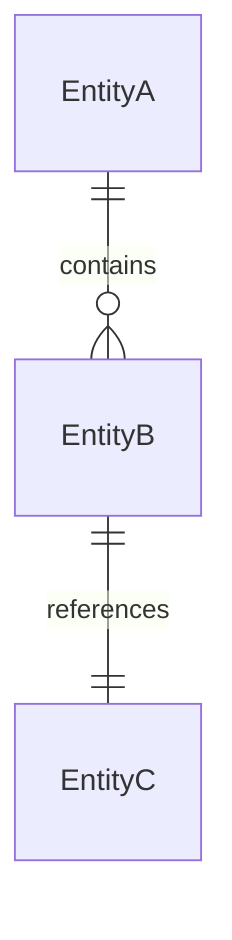
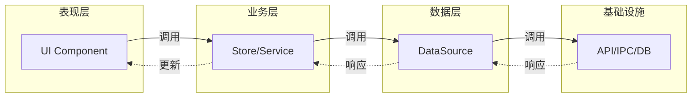
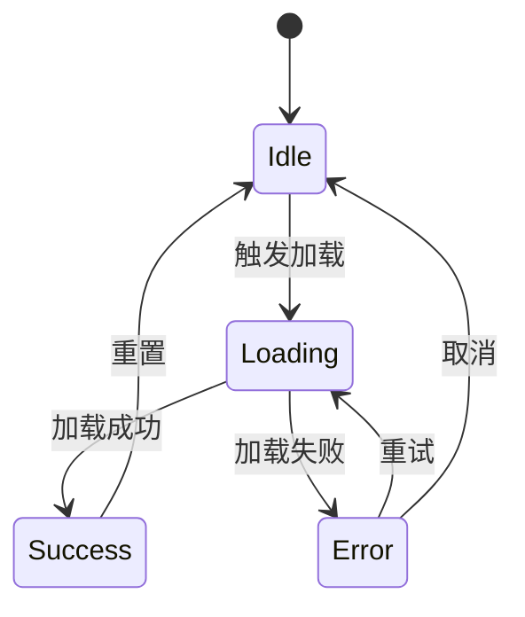
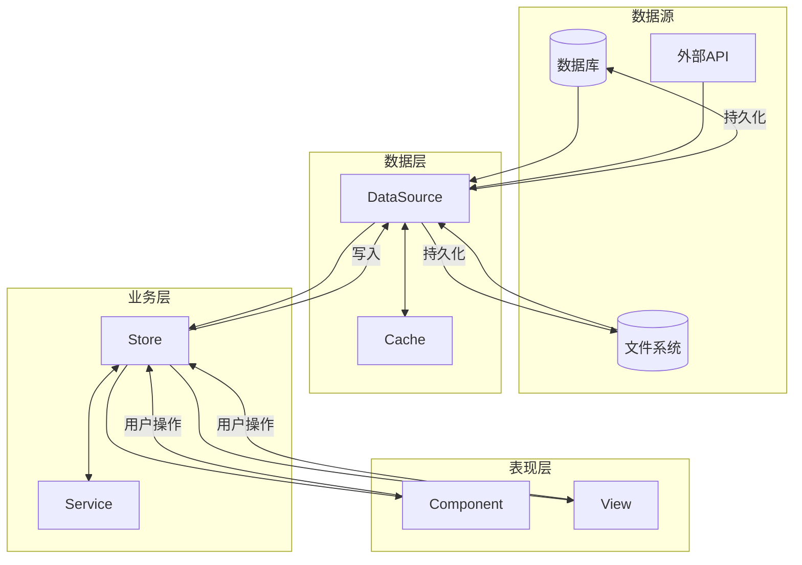
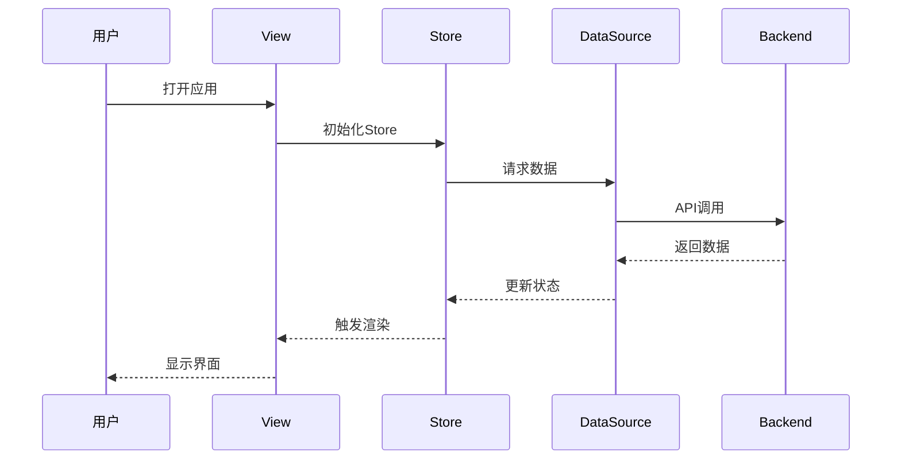
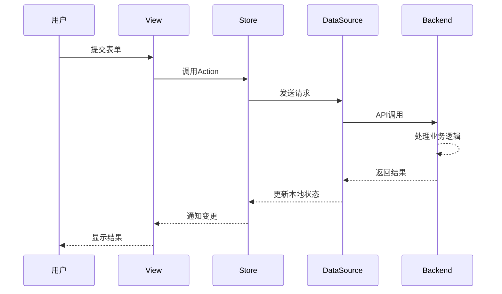

# DeepWiki 文档大纲模板

## 📐 通用架构

```
<!-- DEEPWIKI: <项目名> -->
<!-- AI-HINT: 使用 Select-String -Pattern "^#" 获取目录结构 -->

# [ROOT] <项目名> 技术文档
> 版本: 1.0.0 | 最后更新: YYYY-MM-DD

---

## [VERSION-RECORD]
<!-- 版本记录区 - AI 自动维护 -->
| 序号 | 日期 | Commit | 分支 | 摘要 |
|------|------|--------|------|------|
| 001 | YYYY-MM-DD | xxxxxxx | main | 初始化文档 |
<!-- /VERSION-RECORD -->

---

## [TOC] 目录

- [L1] 项目概述
- [L2] 架构总览
- [L3] 数据模型
- [L4] 调用链路
- [L5] 状态机
- [L6] 数据链路
- [L7] 时序图
- [L8] 模块文档
- [L9] API 参考
- [L10] 开发指南
- [L11] 变更日志

---

# [L1] 项目概述

## [L1-01] 项目定位
<!-- 一句话描述项目是什么 -->

## [L1-02] 技术栈
<!-- 列出核心技术选型 -->

## [L1-03] 目录结构
<!-- 项目文件组织 -->

---

# [L2] 架构总览

## [L2-01] 系统架构图
<!-- 整体架构的 Mermaid 图 -->

## [L2-02] 分层设计
<!-- 表现层 / 业务层 / 数据层 / 基础设施层 -->

## [L2-03] 进程/线程模型
<!-- 如有多进程/多线程，描述其职责 -->

---

# [L3] 数据模型

## [L3-01] 核心实体
<!-- 主要数据结构定义 -->

## [L3-02] 实体关系图


## [L3-03] 存储结构
<!-- 数据库表/文件结构 -->

---

# [L4] 调用链路

## [L4-01] 概述
<!-- 调用链路的整体说明 -->

## [L4-02] 核心链路图


## [L4-03] 链路详解

### [L4-03-A] 链路: <功能名称1>
<!-- 描述具体功能的完整调用路径 -->
```
触发点 → 组件方法 → Store Action → DataSource → 后端API → 响应回传
```

### [L4-03-B] 链路: <功能名称2>
<!-- 另一个核心功能的调用链路 -->

---

# [L5] 状态机

## [L5-01] 概述
<!-- 状态管理的整体设计 -->

## [L5-02] 全局状态结构
```
AppState
├── ModuleA
│   ├── loading: boolean
│   ├── data: T[]
│   └── error: Error | null
├── ModuleB
│   └── ...
└── UI
    ├── currentView: string
    └── ...
```

## [L5-03] 状态机图

### [L5-03-A] <模块A> 状态机


### [L5-03-B] <模块B> 状态机
<!-- 另一个模块的状态流转 -->

## [L5-04] 状态变更规则
<!-- 描述状态变更的触发条件和副作用 -->

---

# [L6] 数据链路

## [L6-01] 概述
<!-- 数据如何在系统中流动 -->

## [L6-02] 数据流向图


## [L6-03] 数据同步机制
<!-- 描述数据如何保持一致性 -->

### [L6-03-A] 读取流程
### [L6-03-B] 写入流程
### [L6-03-C] 缓存策略
### [L6-03-D] 事件通知

---

# [L7] 时序图

## [L7-01] 核心场景时序

### [L7-01-A] 场景: <初始化流程>


### [L7-01-B] 场景: <CRUD操作>


### [L7-01-C] 场景: <实时同步>
<!-- 如有 WebSocket/事件订阅等场景 -->

---

# [L8] 模块文档

## [L8-01] <模块A>
### [L8-01-A] 职责
### [L8-01-B] 接口
### [L8-01-C] 状态
### [L8-01-D] 依赖关系

## [L8-02] <模块B>
### [L8-02-A] 职责
### [L8-02-B] 接口
### [L8-02-C] 状态
### [L8-02-D] 依赖关系

<!-- 按需添加更多模块 -->

---

# [L9] API 参考

## [L9-01] 内部 API
### [L9-01-A] <API分类1>
### [L9-01-B] <API分类2>

## [L9-02] 外部 API
### [L9-02-A] <外部服务1>
### [L9-02-B] <外部服务2>

---

# [L10] 开发指南

## [L10-01] 环境配置
## [L10-02] 开发规范
## [L10-03] 新增模块流程
## [L10-04] 调试技巧
## [L10-05] 常见问题

---

# [L11] 变更日志

## [L11-01] v1.0.0 (YYYY-MM-DD)
### [L11-01-A] 新增
### [L11-01-B] 修改
### [L11-01-C] 删除

<!-- 按版本追加 -->
```

---

## 📋 大纲设计说明

| 章节 | 核心内容 | Mermaid 图类型 |
|------|----------|----------------|
| **[L4] 调用链路** | 函数/方法间的调用关系 | `graph LR/TD` |
| **[L5] 状态机** | 状态流转、触发条件 | `stateDiagram-v2` |
| **[L6] 数据链路** | 数据读写流向、缓存策略 | `flowchart TD` |
| **[L7] 时序图** | 多组件协作的时间顺序 | `sequenceDiagram` |

---

## 📐 标题层级规范 (3-5级)

### 何时使用 3 级标题 `###`

**使用场景：**
- 在 2 级标题下，需要对内容进行**分类**或**分组**时
- 同一主题下有**多个并列的子概念**需要展开
- 需要为某个功能/模块提供**多个维度的说明**

**示例：**
```
## [L4-03] 链路详解
### [L4-03-A] 链路: 用户登录
### [L4-03-B] 链路: 数据导入
### [L4-03-C] 链路: 实时同步
```

**判断标准：**
- ✅ 有 2 个以上的并列子主题
- ✅ 每个子主题都有独立的内容（不只是一句话）
- ❌ 如果只有 1 个子主题，考虑直接在 2 级标题下展开

---

### 何时使用 4 级标题 `####`

**使用场景：**
- 在 3 级标题下，需要进一步**细化步骤**或**拆解流程**
- 某个子概念内部有**多个组成部分**需要逐一说明
- 需要对某个功能进行**分阶段描述**（如：准备 → 执行 → 验证）

**示例：**
```
### [L6-03-A] 读取流程
#### 步骤 1: 检查缓存
#### 步骤 2: 查询数据源
#### 步骤 3: 更新本地状态
#### 步骤 4: 触发 UI 更新
```

**判断标准：**
- ✅ 3 级标题的内容需要**分步骤**或**分阶段**说明
- ✅ 每个步骤/阶段有明确的输入输出或前后依赖
- ❌ 如果只是简单列举，用无序列表 `-` 即可

---

### 何时使用 5 级标题 `#####`

**使用场景：**
- 在 4 级标题下，需要对某个步骤进行**极细粒度的拆解**
- 某个技术细节需要**多个子项**逐一解释（如：参数说明、配置项）
- 需要对某个概念提供**多个示例**或**多种实现方式**

**示例：**
```
#### 步骤 2: 查询数据源
##### 2.1 构造查询条件
##### 2.2 执行 SQL 查询
##### 2.3 解析查询结果
##### 2.4 错误处理
```

**判断标准：**
- ✅ 4 级标题的某个步骤内部逻辑复杂，需要进一步拆解
- ✅ 有明确的子步骤编号（如 2.1, 2.2）
- ❌ 避免过度拆解，5 级标题应该是**最细粒度**

---

## 🚫 避免的反模式

### 反模式 1: 单子节点
```
❌ 错误示例：
## [L4-03] 链路详解
### [L4-03-A] 链路: 用户登录
（只有一个 3 级标题）

✅ 正确做法：
## [L4-03] 链路详解: 用户登录
（直接在 2 级标题下展开，不需要 3 级）
```

### 反模式 2: 过度嵌套
```
❌ 错误示例：
### [L6-03-A] 读取流程
#### 步骤 1: 检查缓存
##### 1.1 读取内存缓存
###### 1.1.1 检查缓存键
（嵌套过深，难以维护）

✅ 正确做法：
### [L6-03-A] 读取流程
#### 步骤 1: 检查缓存
- 读取内存缓存
- 检查缓存键
- 验证缓存有效性
（用列表代替过深嵌套）
```

### 反模式 3: 标题内容过于简单
```
❌ 错误示例：
#### 概述
（标题下只有一句话）

✅ 正确做法：
直接在上级标题下用段落说明，不需要单独开标题
```

---

## 📏 标题层级决策树

```
需要新增内容？
│
├─ 是否有 2+ 个并列主题？
│   ├─ 是 → 使用 ### (3级)
│   └─ 否 → 在当前层级用段落/列表
│
├─ 某个主题需要分步骤？
│   ├─ 是 → 使用 #### (4级)
│   └─ 否 → 用列表即可
│
└─ 某个步骤需要极细拆解？
    ├─ 是 → 使用 ##### (5级)
    └─ 否 → 用列表或代码块
```

---


